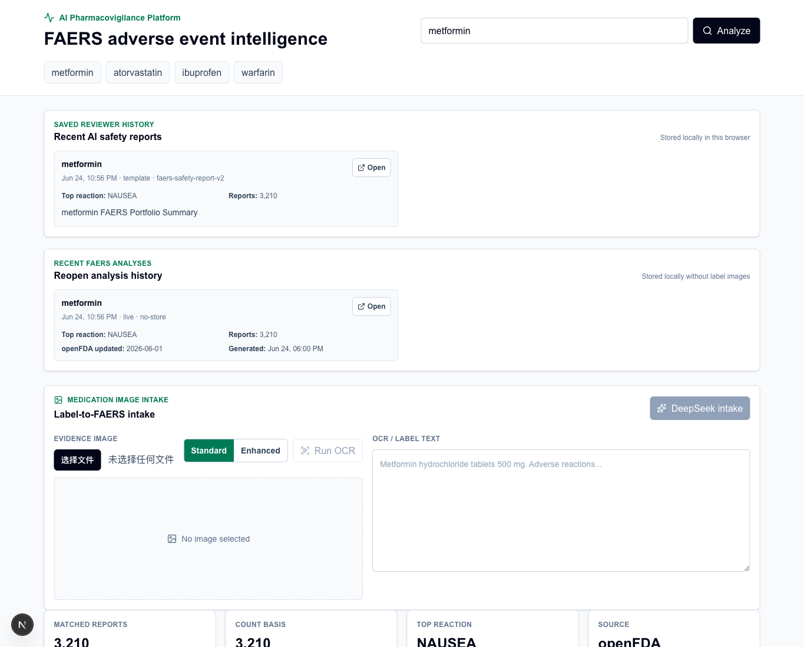
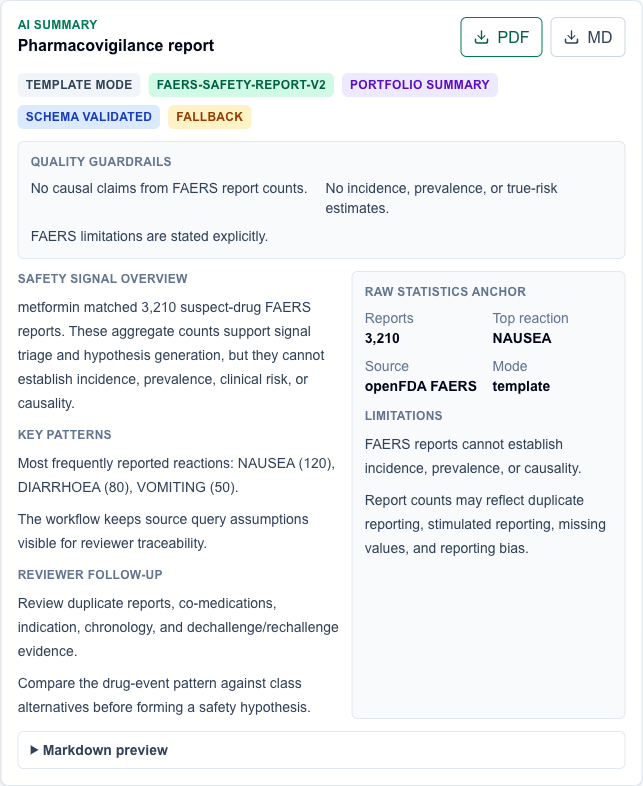
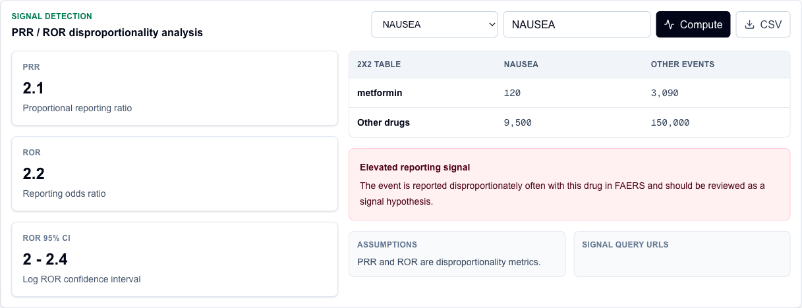
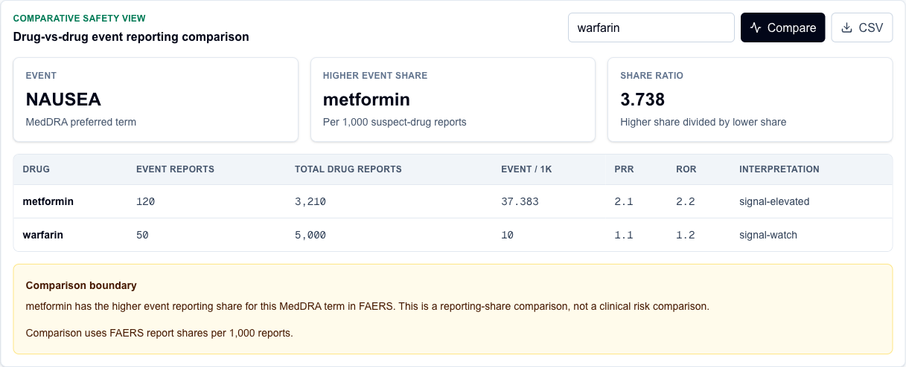
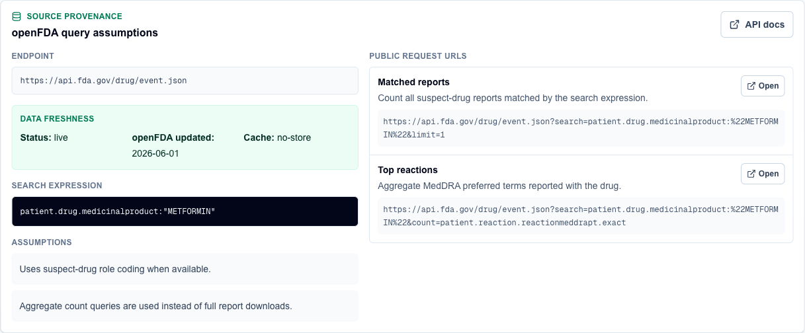
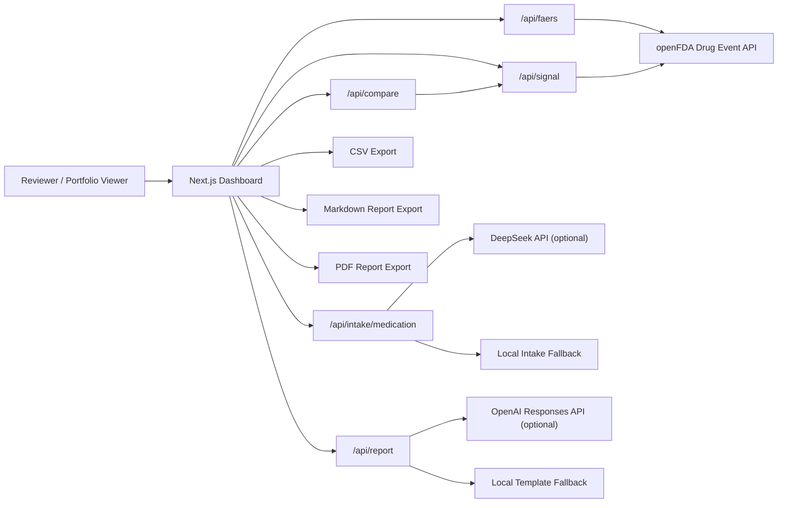

# AI Pharmacovigilance Platform

An AI-assisted pharmacovigilance dashboard for exploring FDA FAERS adverse event reports through the openFDA Drug Adverse Event API.

This project turns a drug name into adverse event patterns, disproportionality signal metrics, source-grounded query provenance, and reviewer-ready safety summaries. It is designed as a portfolio project for AI engineering, pharmacy informatics, drug safety, health data products, and biotech/pharma analytics roles.

> FAERS is a spontaneous reporting system. This project supports signal triage and research workflow demonstration. It does not estimate true incidence, clinical risk, or causality, and it is not medical advice.

## Highlights

- Query openFDA FAERS by generic name, brand name, or FAERS medicinal product.
- Visualize top MedDRA preferred terms, seriousness, serious outcomes, demographics, and reporting-year trends.
- Inspect source provenance, including query assumptions and public openFDA request URLs.
- Compute PRR and ROR disproportionality metrics with a 2x2 reporting table and ROR 95% confidence interval.
- Enter custom MedDRA preferred terms for user-defined drug-event signal checks.
- Run a full reviewer workflow that automatically computes default signal metrics, signal ranking, drug comparison, and structured AI report output after FAERS analysis.
- Rank top reported MedDRA terms by signal interpretation, drug-event report count, PRR, and ROR.
- Filter signal rankings by interpretation, minimum report count, PRR, and ROR.
- Compare two drugs by event reporting share per 1,000 suspect-drug reports.
- Run browser-side OCR on medication label images, then extract structured medication intake fields with DeepSeek API fallback support.
- Generate AI-assisted pharmacovigilance summaries with prompt versioning and report quality guardrails.
- Validate AI report outputs with a structured zod schema before rendering or export.
- Export dashboard data, signal tables, drug comparisons, and Markdown/PDF reports.
- Share reproducible analysis links with `?drug=` and full-workflow links with `?workflow=full`.
- Save recent reviewer report history locally with drug, top reaction, report count, prompt version, and reopen links.
- Verify core query-building and signal-metric logic with Vitest.

## Demo Workflow

1. Enter a drug name, such as `metformin`, `warfarin`, `atorvastatin`, or `ibuprofen`.
2. Optionally upload a medication label image, run browser OCR, and review/edit the extracted label text.
3. Run DeepSeek medication intake, then confirm the extracted drug candidate to launch FAERS analysis and the full reviewer workflow.
4. Review FAERS aggregate charts for adverse reactions, seriousness, demographics, and year trend.
5. If starting from a typed drug name, click `Run full workflow` to automatically compute default PRR/ROR signal metrics, signal ranking, drug comparison, and a structured AI safety report.
6. Inspect the source provenance panel to understand exactly how openFDA was queried.
7. Refine the selected MedDRA preferred term or comparator drug when needed.
8. Copy the URL to reopen the selected drug analysis, or use a `?workflow=full` link to rerun the full reviewer pass.
9. Reopen recent saved reviewer reports from the local history panel.
10. Export Markdown, PDF, or CSV artifacts.

## Product Screens

Regenerate these deterministic mocked-workflow screenshots with:

```bash
npm run screenshots
```

### Dashboard Overview



### AI Pharmacovigilance Report



### PRR / ROR Signal Detection



### Drug-vs-Drug Comparison



### Source Provenance



## Architecture



## Core Features

For a recruiter/interviewer-oriented walkthrough, see [docs/case-study.md](docs/case-study.md). For resume wording and interview talking points, see [docs/resume-interview-guide.md](docs/resume-interview-guide.md).

### FAERS Dashboard

The dashboard builds a suspect-drug search expression and uses aggregate `count` queries instead of large report downloads. This keeps the UI responsive while still showing meaningful signal-triage patterns.

Current panels include:

- Top adverse reactions by MedDRA preferred term
- Serious vs non-serious reports
- Serious outcome flags
- Patient sex distribution
- Patient age buckets
- Received-year trend
- Drug role distribution

### Source Provenance

The source panel shows:

- openFDA endpoint
- The exact FAERS search expression
- Assumptions used for suspect-drug matching
- Public request URLs for each aggregate query

API keys are intentionally omitted from public provenance URLs.

### Signal Detection

The signal panel computes disproportionality metrics for a selected drug-event pair.

2x2 table:

| | Selected Event | Other Events |
|---|---:|---:|
| Selected Drug | a | b |
| Other Drugs | c | d |

Metrics:

- `PRR = (a / (a + b)) / (c / (c + d))`
- `ROR = (a / b) / (c / d)`
- `ROR 95% CI = exp(log(ROR) +/- 1.96 * sqrt(1/a + 1/b + 1/c + 1/d))`

The app labels elevated reporting signals when PRR and ROR are at least 2 and the drug-event cell count is at least 3. This threshold is used for demo triage only; it is not a regulatory decision rule.

### Signal Ranking

The ranking panel computes PRR and ROR for the top reported MedDRA preferred terms and orders them by:

- Signal interpretation class
- Drug-event report count
- PRR
- ROR

This gives reviewers a prioritized triage table across multiple candidate events. It is still a reporting-signal workflow, not a clinical risk ranking.

Reviewers can filter the ranking table by interpretation class, minimum drug-event reports, minimum PRR, and minimum ROR to focus on stronger signal candidates.

### Full Reviewer Workflow

After a FAERS analysis loads, `Run full workflow` derives a default workflow plan from the current analysis. Confirming a medication-label candidate runs the same workflow automatically after the FAERS payload returns:

- The top reported MedDRA preferred term becomes the default signal event.
- The top six reported events are used for signal ranking.
- A comparator drug is selected from the current comparator field, with a safe fallback when it matches the primary drug.
- Signal metrics, signal ranking, drug comparison, and structured report generation are triggered together.

This turns a drug name or confirmed medication-label candidate into a more complete reviewer workspace with fewer manual clicks. The medication-label path still requires human confirmation before any FAERS query or AI report generation starts.

Shareable URLs make the workflow reproducible:

- `/?drug=metformin` opens the dashboard and runs the FAERS analysis for metformin.
- `/?drug=metformin&workflow=full` runs the FAERS analysis and then triggers the full reviewer workflow.

Generated reports are also saved into local browser history. Each saved entry records the drug, top reported reaction, total report count, report mode, prompt version, saved time, and a workflow URL that can reopen the same reviewer pass.

### Drug Comparison

The comparison panel evaluates two drugs against the same MedDRA event and shows:

- Event reports
- Total suspect-drug reports
- Event reporting share per 1,000 reports
- PRR and ROR for each drug
- Which drug has the higher event reporting share

This is a reporting-share comparison, not a clinical risk comparison.

### Medication Image Intake

The intake panel accepts an evidence image, runs browser-side OCR with Tesseract.js, and keeps the OCR text editable before extraction. The API supports two modes:

- `deepseek`: optional DeepSeek chat completions extraction when `DEEPSEEK_API_KEY` is available.
- `fallback`: deterministic local extraction when no DeepSeek key is configured or the provider call fails.

The result is schema-validated before rendering and includes:

- Drug candidates
- Active ingredients
- Strengths
- Dosage form
- Safety-relevant label keywords
- Confidence label
- Human-confirmation requirement
- Extraction limitations
- Local confirmed-evidence history with image metadata, provider mode, confidence, and confirmed drug name

The UI exposes browser OCR progress, provider mode, prompt version, schema validation status, fallback warnings, extraction limitations, and the required human-confirmation step. Confirmed drug candidates are routed into the FAERS dashboard and saved to local confirmed-evidence history. The workflow is intentionally confirmation-first because OCR and label extraction can be incomplete or wrong.

The intake prompt is versioned in [docs/prompts/medication-label-intake-v1.md](docs/prompts/medication-label-intake-v1.md).

### AI Report Generation

The report API supports two modes:

- `template`: deterministic local fallback when no `OPENAI_API_KEY` is configured.
- `openai`: optional OpenAI Responses API generation when an API key is available.

The current report prompt is versioned in [docs/prompts/faers-safety-report-v2.md](docs/prompts/faers-safety-report-v2.md). Report responses include the prompt version, a structured report object, derived Markdown, and a quality checklist.

Reports can be generated in three tone modes while keeping the same schema and safety guardrails:

- `pharmacist-review`: patient-facing medication safety review context.
- `regulatory-briefing`: concise drug safety documentation and escalation context.
- `portfolio-summary`: technical portfolio review context for explaining the AI workflow.

Report output is validated with a zod schema before it is rendered. This gives the AI layer an explicit contract:

- `title`
- `safetySignalOverview`
- `keyPatterns`
- `reviewerFollowUp`
- `limitations`
- `qualityChecks`

Quality guardrails:

- No causal claims from FAERS report counts.
- No incidence, prevalence, or true-risk estimates.
- FAERS limitations are stated explicitly.
- Reviewer follow-up questions are included.
- Signal language is framed as hypothesis generation.

## API Routes

| Route | Purpose |
|---|---|
| `GET /api/faers?drug=metformin` | Returns FAERS aggregate dashboard data and source provenance. |
| `GET /api/signal?drug=metformin&event=NAUSEA` | Returns PRR/ROR signal metrics for a drug-event pair. |
| `GET /api/rankings?drug=metformin&event=NAUSEA&event=DIARRHOEA` | Ranks multiple candidate events by signal metrics. |
| `GET /api/compare?primary=metformin&comparator=warfarin&event=NAUSEA` | Compares event reporting share across two drugs. |
| `POST /api/intake/medication` | Extracts medication candidates and label fields from OCR or label text. |
| `POST /api/report` | Generates a safety summary from a FAERS analysis payload. |

## Tech Stack

- Next.js App Router
- TypeScript
- Tailwind CSS
- Recharts
- zod
- Vitest
- openFDA Drug Adverse Event API
- Tesseract.js browser-side OCR
- DeepSeek chat completions-compatible medication intake endpoint
- OpenAI Responses API-compatible report endpoint

## Project Structure

```text
ai-pharmacovigilance-platform/
  apps/web/
    src/app/api/faers/route.ts
    src/app/api/signal/route.ts
    src/app/api/rankings/route.ts
    src/app/api/compare/route.ts
    src/app/api/intake/medication/route.ts
    src/app/api/report/route.ts
    src/components/PharmacovigilanceDashboard.tsx
    src/lib/openfda.ts
    src/lib/medicationIntake.ts
    src/lib/report.ts
    src/lib/signal.ts
    src/lib/workflow.ts
    src/lib/comparison.ts
    src/lib/*.test.ts
  docs/
    assets/
    case-study.md
    prompts/faers-safety-report-v1.md
    prompts/faers-safety-report-v2.md
    prompts/medication-label-intake-v1.md
    project-plan.md
    roadmap.md
```

## Local Development

```bash
npm install
npm run dev
```

Open the local URL printed by Next.js, usually:

```text
http://localhost:3000
```

## Environment

Copy `.env.example` to `apps/web/.env.local` if you want API keys:

```bash
OPENFDA_API_KEY=
OPENAI_API_KEY=
OPENAI_MODEL=gpt-5.5
DEEPSEEK_API_KEY=
DEEPSEEK_MODEL=deepseek-chat
```

`OPENFDA_API_KEY` is optional but increases rate limits. `OPENAI_API_KEY` is optional; without it, the app generates a local template report. `DEEPSEEK_API_KEY` is optional; without it, medication intake uses local fallback extraction. Browser OCR runs locally and does not require an API key.

See [docs/deployment.md](docs/deployment.md) for deployment steps, safe demo configuration, fallback behavior, and post-deploy smoke tests.

## Verification

```bash
npm run test
npm run test:e2e
npm run lint
npm run build
```

Current tests cover:

- openFDA query construction
- FAERS analysis API route validation, mocked aggregate responses, and upstream error handling
- MedDRA event query construction
- PRR/ROR calculations
- ROR confidence interval behavior
- Signal classification thresholds
- Signal ranking sort order
- Signal ranking filters for interpretation, report volume, PRR, and ROR
- Signal ranking API route behavior
- Full workflow request planning
- Shareable analysis URL parsing and full-workflow query generation
- Saved reviewer history entry generation, deduplication, and size limits
- Saved intake evidence history entry generation, deduplication, and size limits
- AI report tone modes and schema-preserving report generation
- PDF report section generation for reviewer-ready exports
- Medication intake schema parsing and fallback extraction
- Medication intake API fallback and mocked DeepSeek responses

These unit tests do not make live openFDA requests.

The Playwright smoke tests use mocked API responses to verify that `/?drug=metformin&workflow=full` loads the dashboard, runs the full reviewer workflow, renders schema-validated report content, and exposes Markdown/PDF export controls. They also verify the label-evidence path: editable OCR text, schema-validated medication intake, human confirmation, and confirmed-drug workflow launch. The local config uses the system Chrome channel; on a new machine or CI runner without Chrome, install a Playwright browser with `npx playwright install chromium` and adjust the channel if needed.

## Data And Safety Boundaries

FAERS reports are useful for post-market signal detection, but they have important limitations:

- Reports are spontaneous and may be incomplete, duplicated, biased, or stimulated by media attention.
- Report counts cannot be used to calculate true incidence or prevalence.
- A reported association does not prove that a drug caused an event.
- Drug comparisons in this app compare reporting share, not clinical risk.
- All AI output is framed as reviewer support, not medical advice.
- Medication intake must be confirmed by a human before FAERS analysis.
- OCR or label text extraction may miss, distort, or omit medication fields.

## Roadmap

The detailed improvement plan lives in [docs/roadmap.md](docs/roadmap.md).

Near-term priorities:

- Add a concise product walkthrough.
- Deploy a public demo with safe rate limits.

## Resume Bullet

Built an AI-powered pharmacovigilance dashboard using openFDA FAERS data to analyze adverse event patterns, rank PRR/ROR signal candidates, compare drug-event reporting shares, extract medication label fields with DeepSeek-backed schema validation, and generate prompt-versioned safety summaries with explicit FAERS limitations and reviewer guardrails.

More role-specific resume bullets and interview answers are available in [docs/resume-interview-guide.md](docs/resume-interview-guide.md).
