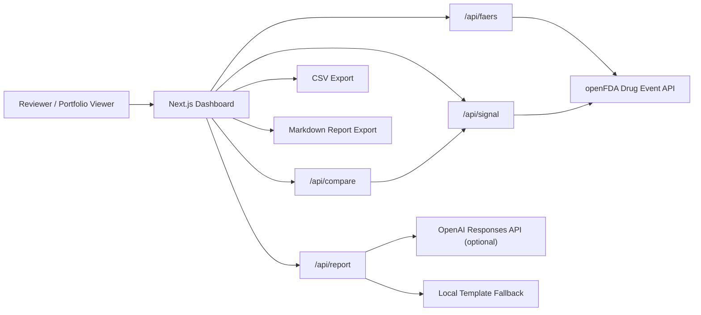

# AI Pharmacovigilance Platform

An AI-assisted pharmacovigilance dashboard for exploring FDA FAERS adverse event reports through the openFDA Drug Adverse Event API.

This project turns a drug name into adverse event patterns, disproportionality signal metrics, source-grounded query provenance, and reviewer-ready safety summaries. It is designed as a portfolio project for AI engineering, pharmacy informatics, drug safety, health data products, and biotech/pharma analytics roles.

> FAERS is a spontaneous reporting system. This project supports signal triage and research workflow demonstration. It does not estimate true incidence, clinical risk, or causality, and it is not medical advice.

## Highlights

- Query openFDA FAERS by generic name, brand name, or FAERS medicinal product.
- Visualize top MedDRA preferred terms, seriousness, serious outcomes, demographics, and reporting-year trends.
- Inspect source provenance, including query assumptions and public openFDA request URLs.
- Compute PRR and ROR disproportionality metrics with a 2x2 reporting table and ROR 95% confidence interval.
- Enter custom MedDRA preferred terms for user-defined drug-event signal checks.
- Rank top reported MedDRA terms by signal interpretation, drug-event report count, PRR, and ROR.
- Compare two drugs by event reporting share per 1,000 suspect-drug reports.
- Generate AI-assisted pharmacovigilance summaries with prompt versioning and report quality guardrails.
- Validate AI report outputs with a structured zod schema before rendering or export.
- Export dashboard data, signal tables, drug comparisons, and Markdown reports.
- Verify core query-building and signal-metric logic with Vitest.

## Demo Workflow

1. Enter a drug name, such as `metformin`, `warfarin`, `atorvastatin`, or `ibuprofen`.
2. Review FAERS aggregate charts for adverse reactions, seriousness, demographics, and year trend.
3. Inspect the source provenance panel to understand exactly how openFDA was queried.
4. Select or type a MedDRA preferred term, then compute PRR/ROR signal metrics.
5. Rank the top reported MedDRA terms to prioritize signal-review candidates.
6. Compare the selected drug against another drug for the same event.
7. Generate a safety summary and export Markdown or CSV artifacts.

## Product Screens

### Dashboard Overview


### AI Pharmacovigilance Report


### PRR / ROR Signal Detection


### Drug-vs-Drug Comparison


### Source Provenance


## Architecture



## Core Features

### FAERS Dashboard

The dashboard builds a suspect-drug search expression and uses aggregate `count` queries instead of large report downloads. This keeps the UI responsive while still showing meaningful signal-triage patterns.

Current panels include:

- Top adverse reactions by MedDRA preferred term
- Serious vs non-serious reports
- Serious outcome flags
- Patient sex distribution
- Patient age buckets
- Received-year trend
- Drug role distribution

### Source Provenance

The source panel shows:

- openFDA endpoint
- The exact FAERS search expression
- Assumptions used for suspect-drug matching
- Public request URLs for each aggregate query

API keys are intentionally omitted from public provenance URLs.

### Signal Detection

The signal panel computes disproportionality metrics for a selected drug-event pair.

2x2 table:

| | Selected Event | Other Events |
|---|---:|---:|
| Selected Drug | a | b |
| Other Drugs | c | d |

Metrics:

- `PRR = (a / (a + b)) / (c / (c + d))`
- `ROR = (a / b) / (c / d)`
- `ROR 95% CI = exp(log(ROR) +/- 1.96 * sqrt(1/a + 1/b + 1/c + 1/d))`

The app labels elevated reporting signals when PRR and ROR are at least 2 and the drug-event cell count is at least 3. This threshold is used for demo triage only; it is not a regulatory decision rule.

### Signal Ranking

The ranking panel computes PRR and ROR for the top reported MedDRA preferred terms and orders them by:

- Signal interpretation class
- Drug-event report count
- PRR
- ROR

This gives reviewers a prioritized triage table across multiple candidate events. It is still a reporting-signal workflow, not a clinical risk ranking.

### Drug Comparison

The comparison panel evaluates two drugs against the same MedDRA event and shows:

- Event reports
- Total suspect-drug reports
- Event reporting share per 1,000 reports
- PRR and ROR for each drug
- Which drug has the higher event reporting share

This is a reporting-share comparison, not a clinical risk comparison.

### AI Report Generation

The report API supports two modes:

- `template`: deterministic local fallback when no `OPENAI_API_KEY` is configured.
- `openai`: optional OpenAI Responses API generation when an API key is available.

The current report prompt is versioned in [docs/prompts/faers-safety-report-v2.md](docs/prompts/faers-safety-report-v2.md). Report responses include the prompt version, a structured report object, derived Markdown, and a quality checklist.

Report output is validated with a zod schema before it is rendered. This gives the AI layer an explicit contract:

- `title`
- `safetySignalOverview`
- `keyPatterns`
- `reviewerFollowUp`
- `limitations`
- `qualityChecks`

Quality guardrails:

- No causal claims from FAERS report counts.
- No incidence, prevalence, or true-risk estimates.
- FAERS limitations are stated explicitly.
- Reviewer follow-up questions are included.
- Signal language is framed as hypothesis generation.

## API Routes

| Route | Purpose |
|---|---|
| `GET /api/faers?drug=metformin` | Returns FAERS aggregate dashboard data and source provenance. |
| `GET /api/signal?drug=metformin&event=NAUSEA` | Returns PRR/ROR signal metrics for a drug-event pair. |
| `GET /api/rankings?drug=metformin&event=NAUSEA&event=DIARRHOEA` | Ranks multiple candidate events by signal metrics. |
| `GET /api/compare?primary=metformin&comparator=warfarin&event=NAUSEA` | Compares event reporting share across two drugs. |
| `POST /api/report` | Generates a safety summary from a FAERS analysis payload. |

## Tech Stack

- Next.js App Router
- TypeScript
- Tailwind CSS
- Recharts
- zod
- Vitest
- openFDA Drug Adverse Event API
- OpenAI Responses API-compatible report endpoint

## Project Structure

```text
ai-pharmacovigilance-platform/
  apps/web/
    src/app/api/faers/route.ts
    src/app/api/signal/route.ts
    src/app/api/rankings/route.ts
    src/app/api/compare/route.ts
    src/app/api/report/route.ts
    src/components/PharmacovigilanceDashboard.tsx
    src/lib/openfda.ts
    src/lib/report.ts
    src/lib/signal.ts
    src/lib/comparison.ts
    src/lib/*.test.ts
  docs/
    assets/
    prompts/faers-safety-report-v1.md
    prompts/faers-safety-report-v2.md
    project-plan.md
    roadmap.md
```

## Local Development

```bash
npm install
npm run dev
```

Open the local URL printed by Next.js, usually:

```text
http://localhost:3000
```

## Environment

Copy `.env.example` to `apps/web/.env.local` if you want API keys:

```bash
OPENFDA_API_KEY=
OPENAI_API_KEY=
OPENAI_MODEL=gpt-5.5
```

`OPENFDA_API_KEY` is optional but increases rate limits. `OPENAI_API_KEY` is optional; without it, the app generates a local template report.

## Verification

```bash
npm run test
npm run lint
npm run build
```

Current tests cover:

- openFDA query construction
- MedDRA event query construction
- PRR/ROR calculations
- ROR confidence interval behavior
- Signal classification thresholds
- Signal ranking sort order
- Signal ranking API route behavior

These unit tests do not make live openFDA requests.

## Data And Safety Boundaries

FAERS reports are useful for post-market signal detection, but they have important limitations:

- Reports are spontaneous and may be incomplete, duplicated, biased, or stimulated by media attention.
- Report counts cannot be used to calculate true incidence or prevalence.
- A reported association does not prove that a drug caused an event.
- Drug comparisons in this app compare reporting share, not clinical risk.
- All AI output is framed as reviewer support, not medical advice.

## Roadmap

The detailed improvement plan lives in [docs/roadmap.md](docs/roadmap.md).

Near-term priorities:

- Add JSON schema validation for report responses.
- Add a concise product walkthrough.
- Add mocked API route tests.
- Add PDF report export.
- Add saved report history.

## Resume Bullet

Built an AI-powered pharmacovigilance dashboard using openFDA FAERS data to analyze adverse event patterns, rank PRR/ROR signal candidates, compare drug-event reporting shares, and generate prompt-versioned safety summaries with explicit FAERS limitations and reviewer guardrails.
