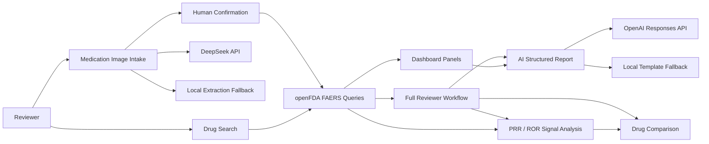

# AI Pharmacovigilance Workspace Case Study

## One-Sentence Summary

Built a full-stack AI pharmacovigilance workspace that turns a drug name or medication-label evidence into FAERS signal triage, disproportionality analytics, drug comparison, and schema-validated AI safety reports with human-in-the-loop review.

## Problem

Drug safety review often starts with fragmented inputs: a medication name, a package or label image, a suspected adverse event, or a need to summarize public post-market reporting data. A portfolio-grade project in this space needs to show more than charting. It should demonstrate domain-specific analytics, source provenance, AI output governance, and clear safety limits.

## Product Goal

Create a reviewer-ready workspace that supports a realistic pharmacovigilance workflow:

1. Start from a drug name or medication-label evidence.
2. Convert confirmed medication candidates into openFDA FAERS queries.
3. Explore aggregate adverse event patterns and source query provenance.
4. Compute PRR/ROR signal metrics and drug-vs-drug reporting-share comparisons.
5. Generate structured AI safety summaries with explicit FAERS limitations.
6. Provide a full reviewer workflow that automatically runs the main analysis steps after a drug candidate is confirmed.
7. Keep every AI-assisted step schema-validated, explainable, and safe for human review.

## System Architecture



## AI Workflow

### Medication Intake

The intake panel accepts a medication image, runs browser-side OCR with Tesseract.js, and keeps the extracted text editable for human review. The `/api/intake/medication` route calls DeepSeek when `DEEPSEEK_API_KEY` is available and otherwise uses deterministic fallback extraction.

The output is validated against a zod schema before rendering:

- Drug candidates
- Active ingredients
- Strengths
- Dosage form
- Risk keywords
- Confidence level
- Human-confirmation flag
- Limitations

### Safety Report

The `/api/report` route generates a structured pharmacovigilance summary from the FAERS analysis payload. It uses OpenAI when configured and deterministic template mode otherwise. Both modes return the same structured report shape and derived Markdown export.

### Full Reviewer Workflow

The dashboard includes a `Run full workflow` action after FAERS analysis. It selects the top reported MedDRA preferred term as the default signal event, ranks the top reported events, compares the selected drug against a comparator, and generates the structured AI report in one reviewer-oriented pass. When the user starts from medication-label evidence, the human confirmation button launches the same full workflow after the confirmed drug's FAERS payload returns.

## Responsible AI Controls

- Model outputs are parsed as JSON and validated with zod schemas.
- OCR text is editable before any model extraction step, with Standard and Enhanced OCR modes plus quality warnings.
- Medication intake cannot trigger analysis or report generation without human confirmation.
- The intake UI exposes OCR mode, OCR quality, provider mode, prompt version, schema validation status, fallback warnings, and extraction limitations.
- FAERS reports are framed as signal-triage evidence, not incidence or causal risk.
- Reports include guardrails against causal claims, incidence claims, and medical advice.
- Provider failures fall back to deterministic local output rather than breaking the workflow.
- Source provenance panels expose the exact openFDA endpoint, assumptions, and public query URLs.

## Engineering Highlights

- Next.js App Router full-stack implementation.
- openFDA FAERS aggregate count queries for responsive analytics.
- PRR/ROR disproportionality metrics with 2x2 table and ROR confidence interval.
- Signal ranking across top MedDRA preferred terms.
- Drug-vs-drug reporting-share comparison.
- Browser-side medication label OCR with editable evidence text.
- DeepSeek-compatible medication label extraction workflow.
- One-click reviewer workflow for signal metrics, ranking, comparison, and AI report generation.
- OpenAI-compatible structured report generation workflow.
- Vitest coverage for core query builders, signal math, rankings, medication intake, and report schema behavior.
- Observability plan for latency, provider fallback, schema validation failures, OCR quality, and privacy-safe healthcare-adjacent logs.

## Demo Script

1. Open the dashboard and upload a medication label image, or paste label text such as:

   ```text
   Metformin hydrochloride tablets 500 mg. Adverse reactions include nausea and diarrhea. Contraindications: severe renal impairment.
   ```

2. Run browser OCR if using an image, review/edit the label text, then run DeepSeek medication intake.
3. Review the schema-validated extraction.
4. Confirm `Metformin` to launch FAERS analysis, PRR/ROR signal metrics, signal ranking, comparison, and structured report output.
5. Inspect adverse reaction charts, seriousness distribution, outcomes, demographics, and year trend.
6. Use `Run full workflow` again only if you change the comparator or want to refresh the reviewer pass.
7. Review the source provenance panel to see the exact openFDA query URLs.
8. Inspect guardrails, structured report sections, and Markdown export.

## Resume Bullets

- Built an AI pharmacovigilance workspace that converts drug names or medication-label evidence into automated FAERS signal triage, PRR/ROR analytics, drug comparison, and schema-validated AI safety reports.
- Integrated browser-side OCR and DeepSeek-compatible medication label extraction with human confirmation, deterministic fallback, and zod schema validation before routing confirmed drug candidates into FAERS workflows.
- Implemented responsible AI controls for a healthcare-adjacent product, including prompt versioning, structured output validation, source provenance, explicit FAERS limitations, and no-causality/no-incidence guardrails.

See [resume-interview-guide.md](resume-interview-guide.md) for role-specific resume bullets, a 30-second project pitch, and interview talking points.

## Limitations And Next Steps

- Browser OCR quality still depends on image clarity, orientation, and label typography, although Enhanced OCR preprocessing and quality scoring reduce silent failures.
- FAERS data cannot establish incidence, prevalence, true risk, or causality.
- A future external vision provider could improve recognition quality for very low-resolution or complex labels.
- Additional workflow completeness could come from a public demo, authenticated review history, and richer export auditing.
