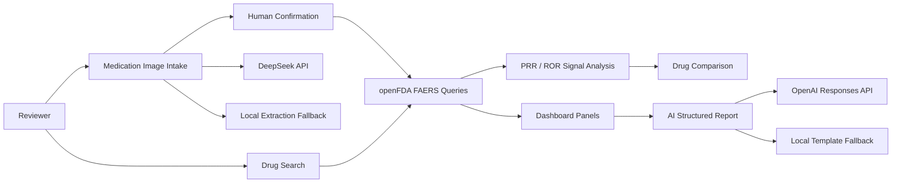

# AI Pharmacovigilance Workspace Case Study

## One-Sentence Summary

Built a full-stack AI pharmacovigilance workspace that turns a drug name or medication-label evidence into FAERS signal triage, disproportionality analytics, drug comparison, and schema-validated AI safety reports with human-in-the-loop review.

## Problem

Drug safety review often starts with fragmented inputs: a medication name, a package or label image, a suspected adverse event, or a need to summarize public post-market reporting data. A portfolio-grade project in this space needs to show more than charting. It should demonstrate domain-specific analytics, source provenance, AI output governance, and clear safety limits.

## Product Goal

Create a reviewer-ready workspace that supports a realistic pharmacovigilance workflow:

1. Start from a drug name or medication-label evidence.
2. Convert confirmed medication candidates into openFDA FAERS queries.
3. Explore aggregate adverse event patterns and source query provenance.
4. Compute PRR/ROR signal metrics and drug-vs-drug reporting-share comparisons.
5. Generate structured AI safety summaries with explicit FAERS limitations.
6. Keep every AI-assisted step schema-validated, explainable, and safe for human review.

## System Architecture



## AI Workflow

### Medication Intake

The intake panel accepts a medication image for evidence preview and OCR or label text for extraction. The `/api/intake/medication` route calls DeepSeek when `DEEPSEEK_API_KEY` is available and otherwise uses deterministic fallback extraction.

The output is validated against a zod schema before rendering:

- Drug candidates
- Active ingredients
- Strengths
- Dosage form
- Risk keywords
- Confidence level
- Human-confirmation flag
- Limitations

### Safety Report

The `/api/report` route generates a structured pharmacovigilance summary from the FAERS analysis payload. It uses OpenAI when configured and deterministic template mode otherwise. Both modes return the same structured report shape and derived Markdown export.

## Responsible AI Controls

- Model outputs are parsed as JSON and validated with zod schemas.
- Medication intake cannot directly trigger analysis without human confirmation.
- FAERS reports are framed as signal-triage evidence, not incidence or causal risk.
- Reports include guardrails against causal claims, incidence claims, and medical advice.
- Provider failures fall back to deterministic local output rather than breaking the workflow.
- Source provenance panels expose the exact openFDA endpoint, assumptions, and public query URLs.

## Engineering Highlights

- Next.js App Router full-stack implementation.
- openFDA FAERS aggregate count queries for responsive analytics.
- PRR/ROR disproportionality metrics with 2x2 table and ROR confidence interval.
- Signal ranking across top MedDRA preferred terms.
- Drug-vs-drug reporting-share comparison.
- DeepSeek-compatible medication label extraction workflow.
- OpenAI-compatible structured report generation workflow.
- Vitest coverage for core query builders, signal math, rankings, medication intake, and report schema behavior.

## Demo Script

1. Open the dashboard and paste OCR text such as:

   ```text
   Metformin hydrochloride tablets 500 mg. Adverse reactions include nausea and diarrhea. Contraindications: severe renal impairment.
   ```

2. Run DeepSeek medication intake and review the schema-validated extraction.
3. Confirm `Metformin` to launch FAERS analysis.
4. Inspect adverse reaction charts, seriousness distribution, outcomes, demographics, and year trend.
5. Review the source provenance panel to see the exact openFDA query URLs.
6. Compute PRR/ROR for a selected MedDRA preferred term.
7. Run drug comparison against another product.
8. Generate the AI pharmacovigilance report and inspect guardrails, structured sections, and Markdown export.

## Resume Bullets

- Built an AI pharmacovigilance workspace that converts drug names or medication-label evidence into FAERS signal triage, PRR/ROR analytics, drug comparison, and schema-validated AI safety reports.
- Integrated DeepSeek-compatible medication label extraction with human confirmation, deterministic fallback, and zod schema validation before routing confirmed drug candidates into FAERS workflows.
- Implemented responsible AI controls for a healthcare-adjacent product, including prompt versioning, structured output validation, source provenance, explicit FAERS limitations, and no-causality/no-incidence guardrails.

## Limitations And Next Steps

- Image upload currently provides evidence preview; OCR or label text must be supplied separately.
- FAERS data cannot establish incidence, prevalence, true risk, or causality.
- The next high-value improvement is browser-side OCR or a dedicated OCR provider before DeepSeek extraction.
- Additional workflow completeness could come from saved intake evidence, saved reports, and PDF export.

